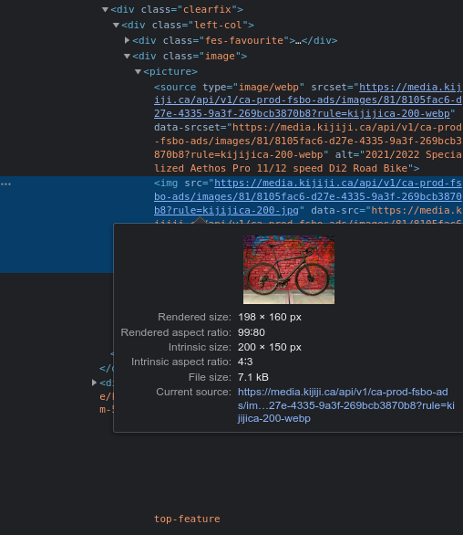
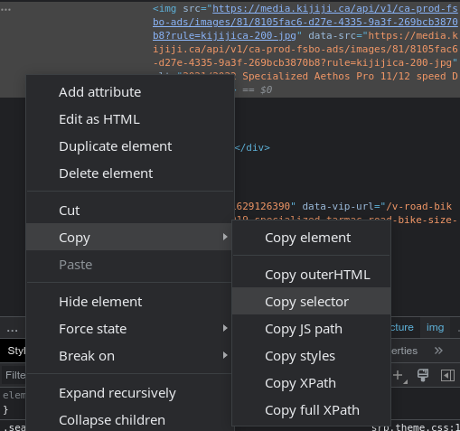
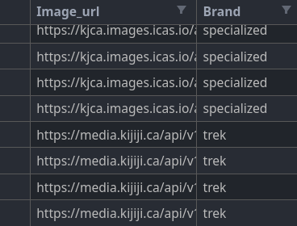
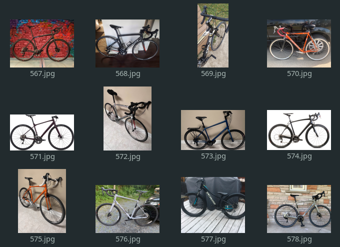

## Context

Sometimes, at the beginning of a data project, the data available to us may be insufficient or even non-existent. You may try to find a dataset in publicly available data sources, but it happens that you can not find what you are looking for. This is where web scraping comes into play, a technique to automate data collection on the web to build your own dataset.

## What is web scraping?

Web scraping consists in collecting data on a website in an automated way. It could be text, images, or data of any type.

To do this, we write a script that downloads the content of a page (usually in HTML format) and then selects the desired elements from it. That is what we will teach you in this article.


**Disclaimer**: Some websites are easier to scrape than others that implement protections to secure their content from scraping bots. For example, I wish you good luck if you aim to scrape Google. In this article, I have taken a relatively easy example for pedagogical reasons. Also, a scraping script is frozen in time, a website can evolve and the script would then no longer work at all.


---

## Use case — Bike images

Let’s say we want to collect bike images of various brands to later build a bike brands classification model. Such a dataset does not seem to exist, that is why we decide to create one.

Ads websites can be an interesting source of data in this case. For example, [Kijiji](https://www.kijiji.ca/) is a Canadian one where ads are classified according to categories.

The action plan is therefore to search each of the targeted brands in the “road bike” category.

### Set up the search URL

First, we locate the URL of the page to scrape by following these steps:

- Browse to [Kijiji](https://www.kijiji.ca/)
- Set the category to “Bikes > Road”
- Set the text query to some bike brand like “specialized”
- Set the location to “Canada” to perform a search over the whole website

As a result, the search prompt should look like this:


After that the URL will be set to:

> [https://www.kijiji.ca/b-road-bike/canada/specialized/k0c648l0?rb=true](https://www.kijiji.ca/b-road-bike/canada/specialized/k0c648l0?rb=true)

Notice that the search parameters we specified are contained in it.

A search often leads to several pages of results. If we browse to the next page we will get this URL containing the page number:

> [https://www.kijiji.ca/b-road-bike/canada/specialized/page-2/k0c648l0?rb=true](https://www.kijiji.ca/b-road-bike/canada/specialized/page-2/k0c648l0?rb=true)

Later on, this will be useful in the script to navigate through the results pages.

### Get image links

Now that we have the URLs of the desired content, we just need to locate the images in the code of the page. To do this, right-click on an ad image and click “Inspect”. The following sidebar will open:



We have located an image link! You understand that doing this task manually to collect all the image links would be tedious. That is why web scraping uses scripts to automate this task.

To localize the images formally, we have to find the “selector”. Right-click on the previous highlighted block and click “Copy > Copy selector”.



You will end up with something like this in your clipboard:

> #mainPageContent > div.layout-3 > div.col-2 > main > div:nth-child(2) > div:nth-child(4) > div > div.left-col > **div.image > picture > img**

This selector indicates the precise location of the image link within the blocks of the HTML code. The final part in bold is the one of interest for the next step.

### Script the collection of image links

We finally have all the pieces to write the script. We will be using Python with the following libraries:

- **Requests** to download a web page
- **BeautifulSoup** to parse the returned page
- **Pandas** to save the results in a CSV file

In our scenario, let’s say we want to collect images for the brands “giant”, “specialized” and “trek”. So we have a main loop going through the brands and then another through the pages. We download each page thanks to **Requests** and then parse it with **BeautifulSoup**. Finally, we can extract image links and save them in a **Pandas** data frame.

```python
import logging
import re
import time

import pandas as pd
import requests
from bs4 import BeautifulSoup

# Enable logging, comment out to disable
logging.basicConfig(level=logging.INFO)

# Set the URL to scrape
base_url = "https://www.kijiji.ca/"
query = "b-road-bike/canada/"
brands = ["giant", "specialized", "trek"]
suffix = "/k0c648l0?rb=true"

# Initialize the dataframe
data = {"image_url": [], "brand": []}

for brand in brands:
    logging.info(f"Searching results for brand '{brand}' ({brands.index(brand) + 1}/{len(brands)})")

    next_page = True
    page_nb = 1

    while next_page:
        # Download the page
        res = requests.get(base_url + query + brand + f"/page-{page_nb}" + suffix)
        res.raise_for_status()

        # Parse the page
        soup = BeautifulSoup(res.text, "html.parser")
        images = soup.select("div.image > picture > img")

        if images:
            for img in images:
                # Extract the image URL
                data["image_url"].append(img.attrs["data-src"].replace("200-jpg", "1600-jpg"))
                data["brand"].append(brand)

            # Get the number of results
            str_results = soup.select_one("div.resultsHeadingContainer-781502691 > span")
            nb_results = re.search(r"([0-9]+) of ([0-9]+)", str_results.text)
            nb_seen = nb_results[1]
            nb_total = nb_results[2]

            logging.info(f"Processed {nb_seen}/{nb_total} images (page {page_nb})")

            if nb_seen == nb_total:
                # Last page
                next_page = False
            else:
                page_nb += 1
        else:
            logging.info(f"Failed to process page {page_nb}, retrying...")
            time.sleep(3)

# Save the dataframe to a CSV file
df = pd.DataFrame(data)
df.to_csv("bike_brands_dataset_kijiji.csv", index=False)
```

Let's see a few details about the implementation. You may notice the use of `.replace("200-jpg", "1600-jpg")` on the image link at line number 39. This is because Kijiji images are stored in different resolutions on their servers and we choose to take a higher one. On line 43, the selector `div.resultsHeadingContainer-781502691 > span` is used to get the number of results displayed up to the current page compared to the total number of results (it was obtained in the same way as above). A regex extracts those numbers on the next line. This allows us to know when we reach the last page.



### Download the images

The final step is to download the images from the collected links. For that, we use a simple script relying once again on **Pandas** and **Requests**. We use **Tqdm** to display the progression bar.

```python
from pathlib import Path

import pandas as pd
import requests
from tqdm import tqdm


def download_image(row):
    index = row.name
    img = row.image_url
    brand = row.brand

    Path(f"images/{brand}").mkdir(parents=True, exist_ok=True)

    path = f"images/{brand}/{index}.jpg"
    if not Path(path).is_file():
        bin_img = requests.get(img).content
        with open(path, "wb") as file:
            file.write(bin_img)


df = pd.read_csv("bike_brands_dataset_kijiji.csv")

tqdm.pandas(desc="Downloading images")
df.progress_apply(download_image, axis=1)
```

The script may take some time to run. In the end, you will get an `images` folder containing a folder for each brand! We can then analyze, clean, or preprocess the images. To collect even more data we can repeat this operation on other websites.



---

## Conclusion

In this article, we saw how to perform web scraping using Python to build our dataset. Web scraping is a powerful tool with a wide range of applications. Knowing how to get data is a valuable skill as a data practitioner.

I hope this article was useful and that you learned something from it. Thank you for reading!

> Inspiration: [https://medium.com/@kaineblack/web-scraping-kijiji-ads-with-python-ef81a49e0e9e](https://medium.com/@kaineblack/web-scraping-kijiji-ads-with-python-ef81a49e0e9e)
>
> To go further: [https://realpython.com/beautiful-soup-web-scraper-python/](https://realpython.com/beautiful-soup-web-scraper-python/)
